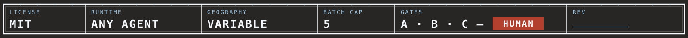
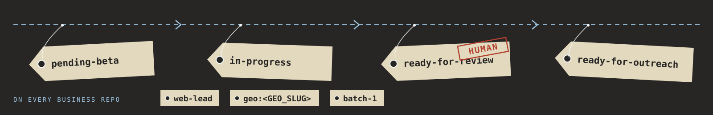

<!-- forged-with: git-a-profile -->
<div align="center">





</div>

Agents case a market, draw one bespoke demo site per business, build it, and draft the outreach. A human signs every gate before anything scales. The demo exists to start a conversation with the owner of a weak website, in any city you point the pipeline at.

> **AGENTS HOLD NO KEYS. THE HUMAN SIGNS EVERY GATE.**

---

## Why this exists

Point agents at a whole city without structure and you get template sites with invented contact data and emails no owner would answer. This pipeline forces research quality, one unique design per business, honest demo positioning, and a written report at the end. Geography stays a campaign variable, so the same drawing set works in Istanbul, Berlin, or a US HVAC corridor.

---

## The drawing set



| Sheet | Loop file | Issued output | Stops for |
|---|---|---|---|
| **00a · The Takeoff** | [`loops/00a-cost-estimate.md`](./loops/00a-cost-estimate.md) | Model choice + cost estimate | Price accepted |
| **00 · Site Prep** | [`loops/00-bootstrap.md`](./loops/00-bootstrap.md) | `BOOTSTRAP_REPORT.md` | Machine ready |
| **01 · The Casing** | [`loops/01-research.md`](./loops/01-research.md) | Excel lead workbook | **Gate A** |
| **02 · The Drawings** | [`loops/02-plan.md`](./loops/02-plan.md) | One plan repo per business | **Gate B** |
| **03 · The Build** | [`loops/03-build.md`](./loops/03-build.md) | Demo PR + `EMAIL_DRAFT.md` | **Gate C** |
| **04 · The File** | [`loops/04-run-report.md`](./loops/04-run-report.md) | Report in [`runs/`](./runs) | Report live on GitHub |

Run one loop per agent session. Paste the fenced prompt from the matching `loops/*.md` into Claude Code with your campaign variables filled, using `/loop [auto]`.

---

## Sheet 00a — price the job before you take it



The estimator reads a campaign size and prices it across 12 models from 4 providers, with quality and speed alongside cost. It runs on Node with zero dependencies:

```bash
node utils/cost-estimator.js estimate 5 3 2   # leads, businesses, sites
```

Details and model switching: [`utils/README.md`](./utils/README.md).

---

## The gates



| Gate | After | The human checks |
|---|---|---|
| **A** | Sheet 01, the casing | Right geography · real businesses · public contacts with source URLs |
| **B** | The first drawing | Unique direction · local tone · an executable `implementation.md` |
| **C** | The first build | Mobile polish · correct locale · an email that sounds human |

Batching past an unsigned gate is how quality collapses. One excellent sample beats ten weak clones; scale Sheets 02 and 03 across the batch after the sample passes.

---

## Campaign variables

Nothing is locked to one place. NYC is a valid choice, never a default. Before Sheet 01, set:

| Variable | Example |
|---|---|
| `ORG` | your GitHub org or username |
| `GEOGRAPHY` | Istanbul · Berlin · Lisbon metro · US Southwest HVAC |
| `GEO_SLUG` | `istanbul` · `berlin` · `lisbon` · `us-sw-hvac` |
| `LOCALE` | `tr` · `de` · `en` |
| `VERTICALS` | tailors, auto repair, plumbing |
| `BATCH_SIZE` | 5 plans/builds (research defaults to 15 leads) |

`GEO_SLUG` goes into file paths, repo names, and tags. Full rules: [`PIPELINE.md`](./PIPELINE.md).

---

## Tags on every business repo



Each business gets its own repo under your `ORG`, named `<GEO_SLUG>-<category>-<business>`, and moves through the four lifecycle tags above. The human stamp at `ready-for-review` is Gate C. Plans must score at least 90/100 on the written rubric in [`PIPELINE.md`](./PIPELINE.md) before a build starts.

---

## Quick start

```bash
gh repo fork PIIIX-org/website-pitch-pipeline --clone
cd website-pitch-pipeline
```

1. **Price it** · run Sheet 00a and pick a model for the budget.
2. **Prep the site** · run Sheet 00 once per machine; verify `BOOTSTRAP_REPORT.md`.
3. **Set the variables** · geography, slug, locale, verticals.
4. **Run the sheets in order** · sign each gate before the next sheet starts.
5. **File the report** · Sheet 04 pushes it to `runs/` on this repo.

Step-by-step version with prerequisites: [`HOW_TO_RUN.md`](./HOW_TO_RUN.md). Install commands for the full stack: [`INSTALL.md`](./INSTALL.md).

---

## Stack defaults

| Layer | Pitch demo default |
|---|---|
| App | Next.js App Router + TypeScript |
| Style | Tailwind + shadcn/ui |
| Motion | GSAP / anime.js when the concept calls for it |
| Data | Skip backends on v0 unless the brief requires one |

---

## The arsenal

| Layer | Tools |
|---|---|
| Design (Tier S) | [frontend-design](https://github.com/anthropics/skills) · [impeccable](https://github.com/pbakaus/impeccable) · [web-design-guidelines](https://github.com/vercel-labs/agent-skills) · [taste-skill](https://github.com/leonxlnx/taste-skill) · [ui-ux-pro-max](https://github.com/nextlevelbuilder/ui-ux-pro-max-skill) · [emilkowalski/skills](https://github.com/emilkowalski/skills) |
| Ideation / architecture | [ADHD](https://github.com/UditAkhourii/adhd) · [Branerail](https://github.com/UditAkhourii/branerail) |
| Copy (Tier S) | [marketingskills](https://github.com/coreyhaines31/marketingskills) · [stop-slop](https://github.com/hardikpandya/stop-slop) · [no-ai-slop](https://github.com/petergyang/no-ai-slop) · ogilvy · [ux-writing](https://github.com/content-designer/ux-writing-skill) |
| Marketing packs | [ai-marketing-claude](https://github.com/zubair-trabzada/ai-marketing-claude) · [digital-marketing-pro](https://github.com/indranilbanerjee/digital-marketing-pro) |
| Research | Apify · [Firecrawl](https://github.com/firecrawl/firecrawl) · [Crawl4AI](https://github.com/unclecode/crawl4ai) · [Scrapling](https://github.com/D4Vinci/Scrapling) · [Webclaw](https://github.com/0xMassi/webclaw) · [Browser Use](https://github.com/browser-use/browser-use) |
| Free images | Pollinations MCP (no key) · Unsplash/Pexels MCP (free keys) · see [`FREE_IMAGE_TOOLS.md`](./FREE_IMAGE_TOOLS.md) |

Full catalog with install commands: [`TOOLS.md`](./TOOLS.md). Ranked design and copy research: [`DESIGN_AND_COPY_SKILLS.md`](./DESIGN_AND_COPY_SKILLS.md). MCP template: [`mcp.example.json`](./mcp.example.json).

---

## The crew works clean

The rules in [`PIPELINE.md`](./PIPELINE.md) are load-bearing, and they are the identity of this pipeline:

- Contact data comes from public sources with a source URL, or it stays out of the workbook.
- Demos carry honest positioning: sales concepts, labeled as such, never passed off as the client's live site.
- No invented identities, no invented activity, no scraping past a site's terms.

---

## The file


A campaign ends when its report exists on this repo:

```text
runs/<YYYY-MM-DD>/<GEO_SLUG>-<campaign-slug>/REPORT.md
```

Closed and aborted campaigns file reports too. Template: [`runs/_template/`](./runs/_template). No report on GitHub means the run is incomplete.

---

<div align="center">



MIT licensed. See [`LICENSE`](./LICENSE).

<sub>Forged with <a href="https://github.com/PIIIX-org/git-a-profile">git-a-profile</a> · <a href="https://github.com/PIIIX-org">PIIIX</a></sub>

</div>
